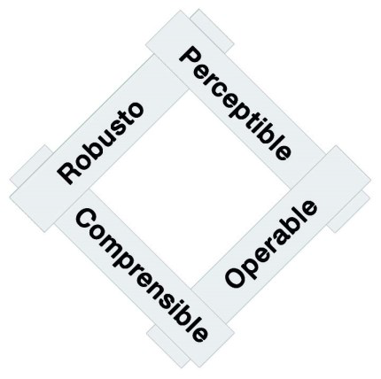
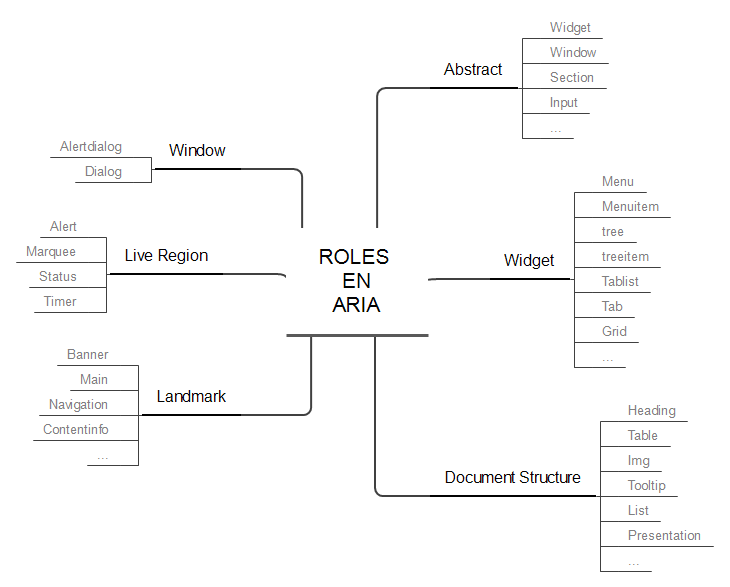
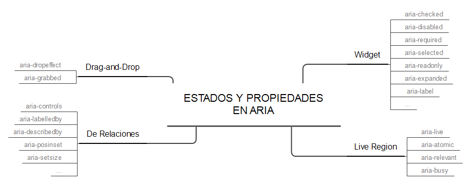

# Accesibilidad Web

Las normativas de accesibilidad web ayudaban a que las personas con discapacidad pudieran acceder a los contenidos que se publicaban en internet. La discapacidad se ha revelado como una oportunidad de explorar cómo la tecnología crea y al mismo tiempo es capaz de resolver situaciones limitantes. Las soluciones a las que tienen derecho las personas con discapacidad (permanente o temporal) son las mismas que resuelven el problema situacional de muchas personas sin discapacidad. No obstante, el primer argumento debería ser más que suficiente para tener en cuenta la Accesibilidad Web.


| Problema | Permanente | Temporal | Situacional | Solución común |
| ------ | ------ | ------ | ------ | ------ |
| Pérdida de Visión | Ceguera | Pupila dilatada por un fondo de ojos, o cataratas | No mirar a la pantalla, como al conducir un coche | Facilitar interacción por voz |
|Baja visión|Glaucoma, o alta miopía|Conjuntivitis|Información legal en letra pequeña|Permitir hacer zoom en la pantalla|
|Ceguera al color|Daltonismo|Deslumbramiento por luces fuertes|Pantalla de móvil oscurecida al tener poca batería, o al darle luz excesiva|Contraste suficiente|
|Pérdida de Audición|Sordera|Otitis, o no entender bien el idioma|Entorno ruidoso, como un bar; o un entorno silencioso, como una biblioteca|Subtitulado|
|Baja Movilidad|Parálisis o pérdida de brazo, Parkinson, o artrosis|Esguince, tendinitis o túnel carpiano|Usar el móvil con una sola mano mientras la otra se usa para agarrarse al autobús|Puntos de interacción de tamaño suficiente|
|Dificultad para fijar y mantener la atención y concentración|Autismo, trastorno por déficit de atención con hiperactividad|Estados de ansiedad o depresión, dolor de cabeza|Realizar otra actividad, como cuidar niños mientras se mira el móvil|Simplicidad en la organización de los contenidos|
|Comprensión lectora|Dislexia, discapacidad cognitiva, o sordera de nacimiento|Bajo nivel educativo, bajo dominio del idioma|Entorno complejo, como una calle bulliciosa|Sencillez de los textos|  


# 1. Las Pautas WCAG 2.1 💻 

Las Pautas de Accesibilidad para el Contenido Web (WCAG por su nombre en inglés, *Web Content Accessibility Guidelines*) disponen de una serie de recomendaciones con el objetivo de hacer el contenido web más accesible, especialmente a personas con discapacidad.

Publicadas por el W3C, la principal organización mundial de estándares de internet, en la actualidad las WCAG son las pautas más reconocidas, seguidas y exigidas a nivel internacional en lo relativo a la accesibilidad web, hasta el punto de integrarse en la mayoría de las legislaciones nacionales y regionales.

## 1.1 Cómo se organizan las WCAG 2.1

Las WCAG 2.1 están organizadas en cuatro capas, cuya complejidad crece exponencialmente.

### 4 principios

Son la base de la accesibilidad web: todo sitio web debe ser perceptible, operable, comprensible y robusto. Los principios no son evaluables.

### 13 pautas

Los principios se dividen en pautas, con el objetivo de agrupar de un modo lógico los criterios de conformidad. Las pautas no son evaluables.

### 78 criterios de conformidad

Los criterios de conformidad sí son evaluables. Dependiendo de una serie de factores que veremos más adelante, los criterios de conformidad se escalan en 3 niveles: A (el más bajo), AA (el nivel medio), y AAA (el más alto).

### Más de 580 técnicas y errores
Cada criterio de conformidad propone una serie de técnicas a seguir y documenta una serie de errores a evitar para alcanzar la conformidad. Por su parte cada técnica y cada error tienen su procedimiento de prueba.

## 1.2 Los cuatro principios y sus pautas  4️⃣

Las WCAG 2.1 se organizan en principios, y estos en pautas. El objetivo es superar los cuatro principios, para lo cual debemos cumplir todas sus pautas.



### 1.2.1 El sitio web debe ser “Perceptible” 👀

Nuestro sitio web puede ser visitado por personas con diferentes tipos de preferencias y capacidades, pero también por robots (buscadores, traductores...). Nuestra información e interfaz deben tener en cuenta esta necesidad y por ello debemos ofrecer alternativas a los usuarios que no pueden utilizar alguno de sus sentidos. Las pautas de este principio son:

    - Pauta 1.1 Alternativas textuales a contenidos no textuales
    - Pauta 1.2 Alternativas a medios tempodependientes, es decir, vídeo y audio
    - Pauta 1.3 El contenido es adaptable a diferentes formas de presentación
    - Pauta 1.4 Distinguible: El contenido es fácil de ver y escuchar


### 1.2.2 El sitio web debe ser “Operable” 👷

Los diseñadores y programadores debemos proporcionar elementos de interacción y de navegación que puedan ser manejados por personas con diferentes capacidades. Las pautas de este principio son:

    - Pauta 2.1 Funcionalidad accesible por teclado
    - Pauta 2.2 Los usuarios tienen tiempo suficiente para leer y usar el contenido
    - Pauta 2.3 El contenido no causa convulsiones
    - Pauta 2.4 Navegable: Los usuarios pueden navegar, encontrar contenido y saber dónde están en todo momento
    - Pauta 2.5 Facilita formas de introducir información

### 1.2.3 El sitio web debe ser “Comprensible” 💬

Si nuestro usuario no entiende de qué le estamos hablando, o le hacemos sentirse perdido, tenemos un problema. Debemos diseñar nuestro sitio web -incluyendo la información y la interfaz de usuario- fácil de usar. Las pautas de este principio son:

    - Pauta 3.1 El contenido es fácil de leer y de comprender
    - Pauta 3.2 El contenido aparece y se maneja de una forma predecible
    - Pauta 3.3 Ayuda en la introducción de datos para evitar y corregir errores

### 1.2.4 El sitio web debe ser “Robusto” 👓

Este es el principio más dependiente de la tecnología. Se basa en la capacidad del sitio web de ser trasmitido e interpretado por los diferentes agentes de usuario.

Los productos de apoyo, también conocidos como ayudas técnicas, son programas o dispositivos que proporcionan la funcionalidad necesaria para cubrir las necesidades de los usuarios con discapacidad, más allá de la que proporcionan las aplicaciones de usuario principales. Son productos de apoyo, por ejemplo, un magnificador de pantalla, un teclado en pantalla, un puntero grande...

La única pauta de este principio es:

    - Pauta 4.1 El contenido es compatible con las herramientas de usuario actuales y futuras

## 1.3 Los criterios de conformidad 📝

Las pautas engloban los criterios de conformidad, los cuales se clasifican por su parte en 3 niveles:

    - A (o Simple-A): el más bajo.
    - AA (o Doble-A): nivel medio.
    - AAA (o Triple-A): el más alto.


# 2. Formularios Accesibles 📑

Los principales requisitos de accesibilidad que deben cumplir los formularios web son:

## 2.1 Etiquetar correctamente los controles del formulario

El elemento LABEL permite indicar semánticamente qué texto funciona como etiqueta de un campo de formulario.

```
<label for=”nombre”>Nombe:</label>
<input type=”text” name=”nombre” id=”nombre” />
```

Para establecer la relación entre la etiqueta y el control del formulario debemos asociarla explícitamente con el atributo FOR, cuyo valor debe ser igual al del ID del control del formulario, ID, que a su vez, debe ser único en la página.

### 2.1.1 Elementos con los que debe usarse LABEL

El elemento LABEL debe usarse con los elementos: “textarea”, “select”, y los “input” de tipo: “text”, “checkbox”, “radio”, “file” y “password”.

### 2.1.2 Elementos con los que no debe usarse LABEL

Por el contrario, el elemento LABEL no debe usarse con los “input” de tipo “image”, que se etiquetan utilizando el atributo ALT.

Por ejemplo:
```
<input type=“image” name=“enviar” src=“boton.gif” alt=“Enviar” />
```

LABEL tampoco debe usarse en los “input” de tipo “submit” o “reset”, los cuales se etiquetan con su atributo VALUE.

Por ejemplo:
```
<input type=“submit” name=“enviar” value=“Enviar” />
```

### 2.1.3 ¿Dónde situamos la etiqueta respecto al campo?

**Antes del campo**, bien encima, bien a la izquierda, con los elementos “textarea”, “select”, y los “input” de tipo “text”, “file” y “password”.

**Detrás del campo** con los “input” de tipo “radio” y “checkbox”.

## 2.2 Usar controles estándar  🔳

La primera norma es utilizar controles de formulario estándar ```(<input>, <textarea>, <select>, <button>, etc.)``` siempre que sea posible y hacerlo conforme a la especificación de HTML5, según la que estemos usando en las páginas.

Usar controles estándar de HTML nos asegura que:

    - puedan ser operables por teclado;
    - su nombre, función, estado y valor, así como los cambios en los mismos, puedan ser determinados por software y, de este modo, ser anunciados por ejemplo a los usuarios de productos de apoyo, como un lector de pantalla.

## 2.3 Cambios de contexto

Los controles de formulario no pueden provocar un cambio de contexto, -como abrir otra página o ventana, mover el foco a otro componente o enviar un formulario-, de forma automática o sin conocimiento del usuario, ni cuando el control coja el foco, ni al entrar datos o cambiar su estado.

## 2.4 ¿Cómo prevenir los errores de los usuarios en los formularios?

### 2.4.1 Identifica los campos obligatorios

En primer lugar debemos identificar los campos obligatorios, preferiblemente con un texto en la etiqueta del campo, y por tanto antes del mismo.

Por ejemplo:

```
<label for=”nombre”>Nombre (obligatorio):</label>
<input type=”text” name=”nombre” id=”nombre” />
```
Adicionalmente podemos añadir al campo la propiedad “aria-required” de WAI-ARIA

Por ejemplo:
```
<input type="text" name=“nombre" id=“nombre“ aria-required="true” />
```

**No podemos identificar los campos obligatorios solo con el color,** por ejemplo con el color del propio campo o de su etiqueta, si acaso puede ser una pista visual adicional.

### 2.4.2 Informa del formato requerido

Otra manera de evitar errores a los usuarios es informándoles de las restricciones en el formato de datos que deben introducir.

Por ejemplo, se puede indicar el formato requerido en la etiqueta del campo y proporcionar un ejemplo bajo el mismo:

```
<label for=”fecha”>Fecha (dd/mm/aaaa):</label>
<input type="text" aria-describedby=“ayuda“ … />
<p id=“ayuda">Por ejemplo: 12/03/2014</p>
```

### 2.4.3 Instrucciones y ayuda

También ayuda a prevenir los errores de los usuarios:

    - incluir instrucciones al comienzo del formulario, si son necesarias.
    - incluir ayuda dependiente del contexto mediante:
        - un enlace a una página de ayuda,
        - un asistente,
        - una solución de corrección ortográfica que ofrezca sugerencias y un mecanismo simple para seleccionar una de ellas.

## 2.5 Atributo Tabindex ☝️

El atributo “tabindex”. En HTML solo pueden tomar el foco por teclado los enlaces y los campos de formulario.

    - tabindex=”0” para que se pueda acceder a dicho elemento por el teclado, mediante el tabulador;
    - tabindex=”-1” cuando se quiere que el elemento pueda obtener el foco mediante JavaScript con .focus().
    - tabindex=”x” donde x es un numero entero. Define un orden de tabulación explícito: 1,2,3,etc.


# 3. WAI-ARIA (*Accessible Rich Internet Application*)

ARIA permite añadir información semántica a cualquier elemento de la interfaz. De este modo el navegador transmite esa información al producto de apoyo, y este al usuario, para que así pueda interaccionar con el sitio o la aplicación web.

Es una especificación del W3C, recomendación desde marzo de 2014.

ARIA nos va a permitir incluir información semántica sobre:

    - La estructura de la página,
    - Los componentes de la interfaz, su comportamiento y la relación entre los mismos

De manera que esta información pueda ser transmitida a los usuarios que utilizan productos de apoyo, como un lector de pantalla, y facilitarles así la comprensión de la página y su interacción con la misma.

Para incluir esta información semántica sobre la interfaz y su comportamiento, WAI-ARIA proporciona una ontología de **roles, estados y propiedades.**

## 3.1 Rol

Un rol define un elemento, nos indica de qué tipo es, qué función tiene.
La especificación define 4 tipos de roles, pero por simplificar, podemos decir que existen dos grandes tipos:

    - aquellos que definen la estructura de la página, en los que podríamos incluir los llamados “landmark roles” (o en español puntos de referencia) que identifican las grandes zonas a las que el usuario querría poder acceder (cabecera, pie, etc.)
    - aquellos roles que definen elementos de la interfaz (“widget roles”).

Incluir el rol de un elemento es tan sencillo como añadir el atributo “role” al elemento e indicar uno de los definidos en la especificación.
Por ejemplo,
```
<div role=”main”>…</div>
```
El rol “main” es un “landmark role”, un rol de estructura, que nos informa, en este caso, de que ese “div” engloba la zona de contenido principal de la página.
Por ejemplo,
```
<ul role=”tree”>…</ul>
```

El rol “tree” es un rol que define un elemento, en este caso una lista que se comporta como un árbol desplegable.

### Landmark roles

Los “landmark roles”, o puntos de referencia, nos permiten definir la estructura de la página.
Los principales, aunque hay más, son:

```
    • <header role=”banner”>
    • <nav role=”navigation”>
    • <main role=”main”>
    • <form role=”search”>
    • <aside role=”complementary”>
    • <footer role=”contentinfo”>
```

### Widget roles
Vamos a ver ahora un ejemplo de un rol que no sea un “landmark role”, un rol que defina un elemento de la interfaz, por ejemplo el rol “tree”, un árbol desplegable.

```
<ul role=”tree”>
<li role=”treeitem” tabindex=”0” aria-expanded=”true”>
Fuits
…
</ul>
```
Este control, que no existe en HTML como tal, se crea mediante etiquetas estándar, como una lista de elementos y programación javascript.

Hay 81 roles categorizados de la siguiente manera:




## 3.2 Estados y propiedades

Además de los roles, ARIA define los estados y propiedades de los diversos controles. La diferencia conceptual entre “estado” y “propiedad” es muy sutil: las propiedades suelen cambiar menos (aunque no siempre) que los estados, que cambian con frecuencia debido a la interacción del usuario.

Pero en la práctica no es necesario diferenciarlos y todos ellos comenzarán por aria-.
Hay 48 estados y propiedades y se dividen en cuatro categorías:



**Atributos de Widget**: *aria-checked, aria-disabled, aria-required, aria-selected, aria-readonly,aria-expanded, aria-label, etc*.

**Atributos de Live Region**: aria-live, aria-atomic, aria-relevant y aria-busy* que permitendefinir cuándo se anunciarán al usuario de producto de apoyo los cambios producidosen las zonas que se actualizan solas, qué parte se anunciará, qué tipo de actualizaciónqueremos que se anuncie o si queremos que temporalmente dejen de anunciarse.

**Atributos de Drag-and-Drop**: *aria-dropeffect y aria-grabbed*. 

**Atributos de relaciones**: es decir, que expresan relaciones o asociaciones entre los elementos que no se pueden determinar fácilmente a partir de la estructura deldocumento: *aria-controls, aria-labelledby, aria-describedby, aria-posinset, aria-setsize*, etc.

Hay tres propiedades fundamentales, a las que hacen referencia muchas de las técnicas ARIA de las WCAG 2.1, que debemos utilizar continuamente y hacerlo bien. Son aquellas que permiten etiquetar o asociar descripciones a los elementos:

    - aria-label,
    - aria-labelledby 
    - aria-describedby.

### Aria-label 👍

Podremos definir la etiqueta, el texto que identifica a un elemento, mediante la propiedad “aria-label”.

```
<div role=”navigation” aria-label=”Menú principal”>…</div>
<div role=”navigation” aria-label=”Menú secundario”>…</div>
```

Con la propiedad “aria-label” indicamos directamente el texto, por ejemplo para diferenciar dos zonas de menú diferentes. Ambas zonas tienen el mismo rol pero su diferente etiqueta permitirá que sean anunciadas como “Menú principal” o “Menú secundario”.

### Aria-labelledby 👍

También tenemos una propiedad que nos permite etiquetar elementos indicando el id o ids de los elementos que actúan como etiqueta.

```
<p id=”report-title”>Informe de ventas 2012</p>
<ul>
<li><a aria-labelledby=”report-title pdf” href=”ventas.pdf” id=”pdf”>PDF</a></li>
<li><a aria-labelledby=”report-title doc” href=”ventas.doc” id=”doc”>Word</a></li>
</ul>
```

De esta manera, el enlace PDF del ejemplo anterior puede ser etiquetado y anunciado como “Informe de ventas 2012 PDF”.

### Aria-describedby 👍

La propiedad “*aria-describedby*” nos permite indicar la descripción de un elemento indicando el id o ids del elemento o elementos que lo describen.
```
<input aria-describedby=”ayuda” … />
<p id=”ayuda”>La contraseña debe tener mínimo 6 caracteres.</p>
```

### Aria-required 👍

Podemos indicar si un campo es obligatorio con la propiedad “aria-required”:
```
<input type=”text” name=”usrname” id=”usrname” aria-required=”true” />
```

## 3.3 Las técnicas específicas de ARIA
Las WCAG 2.1 incluyen 20 técnicas específicas para la tecnología ARIA:

    1. Usa la propiedad aria-describedby para describir los controles de interfaz de usuario.
    2. Identifica los campos obligatorios con la propiedad aria-required.
    3. Utiliza los roles para informar del rol de cada componente de interfaz de usuario.
    4. Utiliza los estados y propiedades para informar del estado de cada componente de interfaz de usuario.
    5. Etiqueta objetos con aria-label.
    6. Define el objetivo del enlace con aria-labelledby.
    7. Define el objetivo del enlace con aria-label.
    8. Crea una etiqueta concatenando varios nodos de texto con aria-labelledby.
    9. Usa aria-labelledby para para dar un texto alternativo a contenido no textual.
    10. Usa los roles landmarks para identificar las zonas de la página.
    11. Identifica encabezados con role=heading.
    12. Nombra regiones y landmarks con aria-labelledby.
    13. Provee etiquetas invisibles con aria-label cuando no puedas usar etiquetas visibles.
    14. Describe imágenes con aria-describedby.
    15. Nombra controles de interfaz de usuario con aria-labelledby.
    16. Usa roles de agrupación para identificar controles de formulario relacionados.
    17. Identifica errores con role=alertdialog.
    18. Identifica errores con role=alert o con live regions.
    19. Identifica regiones de la página con role=region.
    20. Identifica los campos con errores con aria-invalid

# Vínculos de interés 

- **[https://www.usableyaccesible.com/textosalternativosaccesibles/mapa_decision_texto_alternativo.php]** Mapa de decisión para proporcionar textos alternativos adecuados parlas las imágenes de tu web
- **[https://guia-wcag.com/es/]** ¡WCAG 2.1 simplificado!
- **[https://intopia.digital/wp-content/uploads/2019/10/2019-WCAG2.1-Map-Intopia-plus-reading-order.pdf]**  WCAG 2.1 MAP
- **[https://usableyaccesible.com/]**  Olga Carreras Montoto - Consultora freelance, Accesibilidad web.

